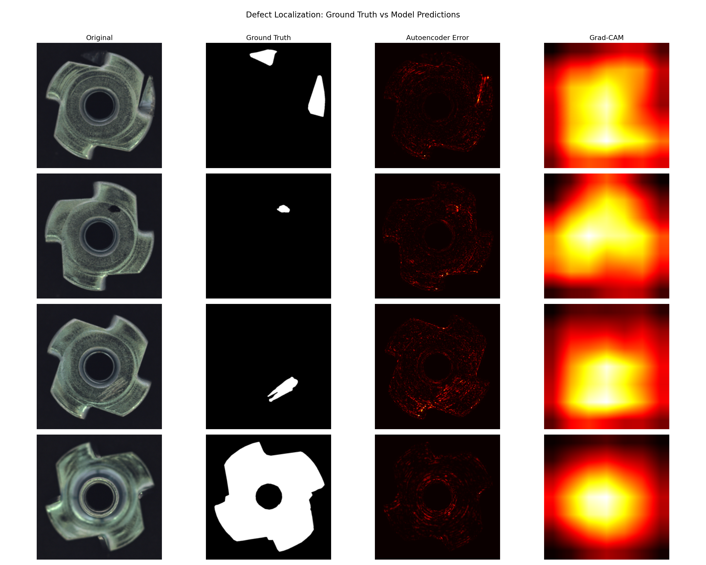

# Manufacturing Defect Detection

Anomaly detection on the MVTec AD `metal_nut` category, training only on defect-free images and evaluating against four unseen defect types (bent, color, flip, scratch).

This project contrasts two approaches on the same dataset — a from-scratch convolutional autoencoder and a pretrained ResNet feature-distance method — and treats the gap between them as the main result rather than hiding the failure.

## Results

| Method                              | AUC-ROC  | F1    | Precision | Recall |
| ----------------------------------- | -------- | ----- | --------- | ------ |
| Convolutional Autoencoder (MSE)     | **0.398** | 89.9% | 81.6%     | 100.0% |
| ResNet18 features + Mahalanobis     | **0.894** | 93.3% | 89.2%     | 97.8%  |

The autoencoder's F1 looks competitive but is misleading — its AUC is below chance. The F1-optimal threshold for the AE collapses to "flag nearly everything as defective," which yields 100% recall and precision close to the defective base rate (81% of the test set). The full diagnosis is in the "Why the autoencoder failed" section below.

## Dataset

MVTec Anomaly Detection benchmark, `metal_nut` category:

- **Training:** 220 defect-free images
- **Test:** 22 good + 93 defective (25 bent, 22 color, 23 flip, 23 scratch)
- **Resolution:** 700×700 RGB, resized to 256×256 (AE) or 224×224 (ResNet)

The training set contains *only* good parts. This is the realistic setting for manufacturing QC, where the failure modes you encounter in production are rarely the ones you have labeled examples of at training time.

## Approach 1 — Convolutional Autoencoder

A standard encoder-decoder trained to reconstruct good images. The theory: after training, the model can reconstruct normal textures well; on a defective image, the reconstruction fails specifically in the defective region, and per-pixel error reveals the defect.

- 4-block encoder compressing 256×256×3 → 16×16×256
- Symmetric decoder with transposed convolutions
- 562K parameters, trained 100 epochs with MSE loss (final loss 0.00089)

**Result: AUC 0.398.** Worse than random.

### Why the autoencoder failed

Looking at the actual reconstruction error distributions:

```
Good scores   — mean: 0.001095, std: 0.000283
Defect scores — mean: 0.000971, std: 0.000166
```

The defective images reconstructed *better* than the good ones, on average. This is a known failure mode of vanilla autoencoders on textured surfaces: the model learns to reproduce the general texture statistics of the metal_nut surface without tightly fitting the "good" manifold. Defective regions (scratches, color patches, flipped orientation) often have *lower* high-frequency content than normal textured metal, so they sit within the reach of the decoder's smoothing behavior.

Increasing capacity wouldn't fix this — it would make the problem worse by improving reconstruction of defects too. The real fix would require structural changes (e.g., VAE with a tighter bottleneck, feature-space reconstruction loss, or memory-augmented architectures like MemAE). This was the cue to change approach rather than tune hyperparameters.

## Approach 2 — Pretrained ResNet + Mahalanobis Distance

A feature-distance approach that avoids the generative-reconstruction problem entirely:

1. Extract 512-dim features from each training image using ImageNet-pretrained ResNet18 (final pooled layer, classification head removed)
2. Estimate the mean and covariance of the "good" feature distribution (with small diagonal regularization to avoid singular covariance)
3. Score each test image by its Mahalanobis distance from the good distribution
4. Threshold to classify

**Result: AUC 0.894, F1 93.3%.**

Why this works where the AE didn't: ImageNet pretraining gives the model strong priors for edges, textures, and shapes. A flipped metal nut or a scratched surface produces feature-space deviations even though pixel-level reconstruction is easy. The Mahalanobis distance also accounts for feature correlations in the normal set, which Euclidean distance would not.

### Per-defect-type breakdown

| Defect type | Mean anomaly score | Detection rate at F1-optimal threshold |
| ----------- | ------------------ | -------------------------------------- |
| Good        | 21.9               | 50.0% correctly accepted               |
| Bent        | 26.9               | 100.0%                                 |
| Color       | 26.9               | 95.5%                                  |
| Flip        | 54.5               | 100.0%                                 |
| Scratch     | 32.9               | 95.7%                                  |

**Flip** is trivially detectable because it's a whole-object structural change — the feature vector shifts dramatically. **Bent**, **color**, and **scratch** defects produce moderate shifts, all reliably caught. The real cost of the F1-optimal threshold shows up on good parts: half of them are incorrectly rejected. This is the threshold tradeoff that motivates the next section.

### Threshold tradeoff analysis

The F1-optimal threshold is not always the deployable threshold. In manufacturing QC, the cost of a false rejection (scrapping a good part) and the cost of a false accept (shipping a defective part) are rarely equal, and they're rarely symmetric.

| Threshold | Accuracy | Precision | Recall | F1    | False-alarm rate |
| --------- | -------- | --------- | ------ | ----- | ---------------- |
| 20.1      | 85.2%    | 85.8%     | 97.8%  | 91.5% | 68.2%            |
| 23.0      | 85.2%    | 92.2%     | 89.2%  | 90.7% | 31.8%            |
| 25.1      | 75.7%    | 94.5%     | 74.2%  | 83.1% | 18.2%            |
| 28.1      | 66.1%    | 98.2%     | 59.1%  | 73.8% | **4.5%**         |
| 30.2      | 53.0%    | 97.6%     | 43.0%  | 59.7% | 4.5%             |

A station with a manual rework loop can tolerate a high false-alarm rate in exchange for high recall (threshold ~20). A station shipping directly to a customer needs a low false-alarm rate even at the cost of recall (threshold ~28, catching only 59% of defects but rejecting only 4.5% of good parts). The right operating point is a business decision, not a metric-maximization problem.

## Localization analysis

Beyond binary classification, I evaluated how well each approach localizes defects using the MVTec pixel-level ground truth masks.



**Neither method localizes reliably.** Autoencoder error maps are dominated by generic edge and texture residuals that correlate poorly with ground-truth defect regions. Grad-CAM on the ResNet features consistently attends to the central region of the nut regardless of where the actual defect is — including cases where the defect is at the edge (scratch, chip) or distributed across the whole part (flip).

This is architecturally expected: the Mahalanobis approach operates on a globally-pooled 512-dim feature vector, so there's no spatial signal to recover. Grad-CAM highlights regions that contribute most to the pooled activation, not regions that distinguish good from defective.

**Implication.** The model is suitable for binary accept/reject decisions on a production line but does not support operator-facing defect highlighting or root-cause analysis. For pixel-level localization, approaches that retain spatial feature grids (PatchCore, PaDiM, SPADE) would be the appropriate next step.

## What I'd do next

- **PatchCore for localization** — same pretrained-feature philosophy, but operates on spatial feature patches rather than the pooled vector. State of the art on MVTec AD and would directly address the localization gap.
- **Evaluate on other MVTec categories** — `metal_nut` is a textured rigid object. Performance on fabric (`carpet`, `leather`) vs. complex objects (`cable`, `transistor`) would stress-test the approach.
- **Calibration with defect cost asymmetry** — the threshold table is currently evaluated at uniform cost; a real deployment would tune against per-defect-type miss cost.

## Repo structure

```
notebooks/
  01_data_exploration.ipynb   # Data loading, AE training, ResNet features, eval, Grad-CAM
models/
  autoencoder.pth
results/
  sample_images.png
  training_loss.png
  reconstruction_comparison.png
  anomaly_detection_performance.png
  feature_anomaly_detection.png
  threshold_tradeoff.png
  localization_comparison.png
data/
  metal_nut/                  # MVTec AD dataset (not tracked)
```

## Setup

```bash
pip install torch torchvision numpy pandas scikit-learn scipy pillow matplotlib
# Download MVTec AD from https://www.mvtec.com/company/research/datasets/mvtec-ad
# Extract metal_nut/ into data/
jupyter notebook notebooks/01_data_exploration.ipynb
```

## References

- Bergmann et al., *MVTec AD — A Comprehensive Real-World Dataset for Unsupervised Anomaly Detection*, CVPR 2019
- Roth et al., *Towards Total Recall in Industrial Anomaly Detection* (PatchCore), CVPR 2022
- Defard et al., *PaDiM: a Patch Distribution Modeling Framework for Anomaly Detection*, 2020
